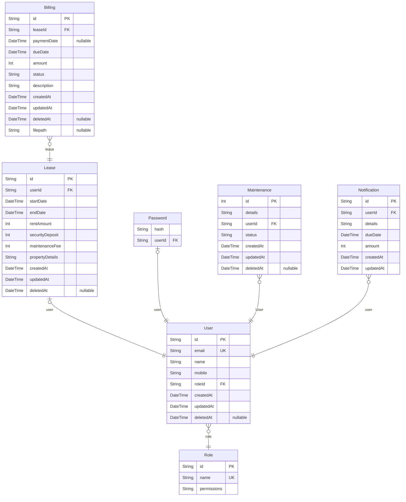

# AMS
> Generated by [`prisma-markdown`](https://github.com/samchon/prisma-markdown)

- [default](#default)

## default

### `User`

**Properties**
  - `id`: 
  - `email`: 
  - `name`: 
  - `mobile`: 
  - `roleId`: 
  - `createdAt`: 
  - `updatedAt`: 
  - `deletedAt`: 

### `Lease`

**Properties**
  - `id`: 
  - `userId`: 
  - `startDate`: 
  - `endDate`: 
  - `rentAmount`: 
  - `securityDeposit`: 
  - `maintenanceFee`: 
  - `propertyDetails`: 
  - `createdAt`: 
  - `updatedAt`: 
  - `deletedAt`: 

### `Billing`

**Properties**
  - `id`: 
  - `leaseId`: 
  - `paymentDate`: 
  - `dueDate`: 
  - `amount`: 
  - `status`: 
  - `description`: 
  - `createdAt`: 
  - `updatedAt`: 
  - `deletedAt`: 
  - `filepath`: 

### `Password`

**Properties**
  - `hash`: 
  - `userId`: 

### `Role`

**Properties**
  - `id`: 
  - `name`: 
  - `permissions`: 

### `Maintenance`

**Properties**
  - `id`: 
  - `details`: 
  - `userId`: 
  - `status`: 
  - `createdAt`: 
  - `updatedAt`: 
  - `deletedAt`: 

### `Notification`

**Properties**
  - `id`: 
  - `userId`: 
  - `details`: 
  - `dueDate`: 
  - `amount`: 
  - `createdAt`: 
  - `updatedAt`: 